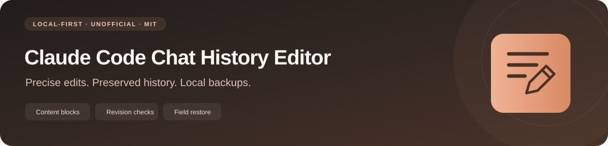
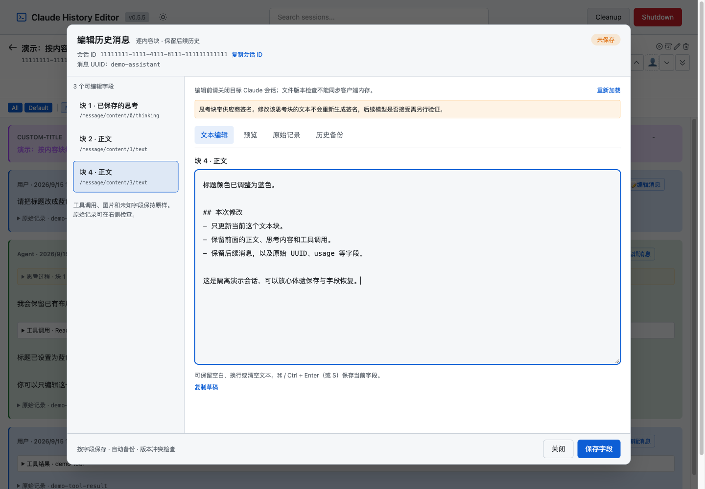

<div align="center">



### Edit one content block. Keep the conversation that follows.

[简体中文](README.md) · **English**

[](https://github.com/we1005/claude-code-chat-history-editor/actions/workflows/ci.yml)
[](LICENSE)
[](https://svelte.dev/)
[](https://www.typescriptlang.org/)
[](https://nodejs.org/)
[](https://pnpm.io/)

</div>

---

A local Web editor based on [es6kr/claude-code-sessions](https://github.com/es6kr/claude-code-sessions). It retains the TypeScript Core and SvelteKit application, adding **versioned, field-level transcript editing**.

**This version supports Claude Code only. Codex is not implemented.** This is an unofficial community project. Editing operates on local JSONL files without model calls. The new editing interface is primarily Chinese, with English documentation here.

## Features

- Edit user/human/assistant text, including the second or third text block.
- Edit saved thinking text and tool-result strings, including nested text blocks, while retaining other structures.
- Inspect the exact raw record, physical line number, session ID and message UUID.
- Preserve unrelated bytes: unknown fields, large numeric literals, BOM, blank lines, CRLF and subsequent records.
- Use the **last occurrence of a duplicate UUID**, matching the upstream reader; earlier copies remain untouched.
- Check file revisions, back up originals, replace via a synchronized temporary file, then read back and verify.
- Restore **one field**, retaining later messages and changes to other fields.



## Quick start

Have Node.js 22+ and npm available. pnpm automatically downloads and uses the project-pinned **Node.js 24.15.0**, required by the current upstream dependency set.

```bash
git clone https://github.com/we1005/claude-code-chat-history-editor.git
cd claude-code-chat-history-editor
./start.sh
```

The launcher installs missing dependencies, builds Core and starts the local Web server. It tries port `5173` and increments when occupied. **Use the URL printed after startup.** Keep the terminal running; `Ctrl+C` stops services started by this invocation.

Try isolated demo data first:

```bash
./start.sh --demo
./start.sh --demo --port 5180
```

Demo records live under `.editor-test/demo-home/` and do not modify real sessions. The shell launcher supports macOS/Linux; Windows users can use WSL.

The default data directory is `~/.claude/projects`. Override it explicitly if needed:

```bash
CLAUDE_SESSIONS_DIR=/absolute/path/to/projects ./start.sh
```

No OpenCode server or model API key is needed for editing. Run `./start.sh --help` for options.

## Workflow

1. Select a project and session. Text, thinking and tools are included by default; use **All** for additional internal event categories.
2. Click **编辑消息** (Edit message).
3. Choose a specific field on the left. Edit text, inspect **原始记录** (Raw record), or use sanitized Markdown **预览** (Preview).
4. Click **保存字段** (Save field), or press `⌘ / Ctrl + Enter` or `⌘ / Ctrl + S`.
5. Open **历史备份** (History) to inspect an earlier value and restore its field.

Drafts remain in the editor on conflicts and errors. Switching fields, closing the dialog or leaving the page prompts before discarding unsaved changes.

## Persistence and restore

```text
Read original bytes and the last matching UUID
  → Locate a specific JSON string node
  → Compare the client's file revision
  → Persist an original-file backup
  → Replace only that token in a synchronized temporary file
  → Recheck the source, rename and read back
```

Backups are stored at each project directory's `.history-editor-backups/<session-id>/`, with `0600` files on POSIX. They contain the full original file and field change metadata. The API lists up to 50 backups for the selected message without returning the full original session.

Field restore goes through the same save path and creates another backup. It restores only that field, not the old whole-session snapshot. Structural or metadata changes to the target record block automatic restore. Full original snapshots are retained for diagnosis/manual recovery, not automatically replayed over later history.

## Boundaries

- Close the target Claude session before editing. The editor lock coordinates this tool's writers, not a running Claude client's memory. Revision checking plus rename is not a cross-process atomic compare-and-swap.
- Editing pre-compaction history does not regenerate its summary. Real Claude CLI cold-resume and subsequent model-request behavior have **not** been automatically verified.
- Thinking signatures are retained, not regenerated. Providers may reject changed signed thinking content.
- The editor does not implicitly create/delete blocks or modify UUIDs, roles, tool-call IDs or tool inputs. Images and unknown structures are read-only. Empty strings are supported.
- Malformed JSONL and ambiguous JSON property names cause refusal rather than silent data loss. New text field values are limited to 8 MiB.
- The strengthened persistence flow applies to the new **field editing and field restore** paths. Inherited delete/split/rename operations keep their original semantics; this is not a claim that every upstream mutation is transactional.
- This is a local tool; the launcher binds to `127.0.0.1`. It is not a multi-user authenticated public service.

## Development and production

```bash
pnpm install --frozen-lockfile --ignore-scripts
pnpm build:core
pnpm dev
```

Production:

```bash
pnpm build:core
pnpm build:web
HOST=127.0.0.1 PORT=5173 BODY_SIZE_LIMIT=10M pnpm --filter @claude-sessions/web exec node build/index.js
```

pnpm selects the Node version from `.npmrc`. Internal workspace package names retain their upstream names. Upstream npm/VSIX publishing workflows are archived under `.github/upstream-workflows/`; only the editor CI is active.

## Verification

```bash
pnpm test:core
pnpm test:web
pnpm --filter @claude-sessions/core typecheck
pnpm --filter @claude-sessions/web typecheck
pnpm --filter @claude-sessions/web exec playwright install chromium
pnpm test:editor
```

If Google Chrome is already installed, use `PLAYWRIGHT_CHANNEL=chrome pnpm test:editor`. E2E tests use an isolated HOME and synthetic sessions, covering block selection, file persistence, retained history, field restore, stale drafts, empty text, preview sanitization and narrow viewports. No live model calls are made.

## Code map

| File                                                          | Purpose                                                                     |
| ------------------------------------------------------------- | --------------------------------------------------------------------------- |
| `packages/core/src/session/editor.ts`                         | Token-level edits, revisions, backups, atomic replacement and field restore |
| `packages/web/src/routes/api/editor/`                         | Versioned HTTP endpoints                                                    |
| `packages/web/src/lib/components/HistoryMessageEditor.svelte` | Fields, drafts, preview, raw records and history                            |
| `packages/web/src/lib/components/MessageBlocks.svelte`        | Ordered rendering of editable mixed-content messages                        |
| `packages/web/editor-e2e/`                                    | Isolated browser/API/filesystem regression tests                            |

See [AGENTS.md](AGENTS.md), [CLAUDE.md](CLAUDE.md) and the [implementation notes (Chinese)](改造与验证说明.md).

## Credits and license

Based on upstream commit [39f3c7d](https://github.com/es6kr/claude-code-sessions/tree/39f3c7dea78acd38e7127563217d8a332b64bb5d), retaining its copyright notice under the [MIT License](LICENSE). Precise JSON string locations use Microsoft's [jsonc-parser](https://github.com/microsoft/node-jsonc-parser).
