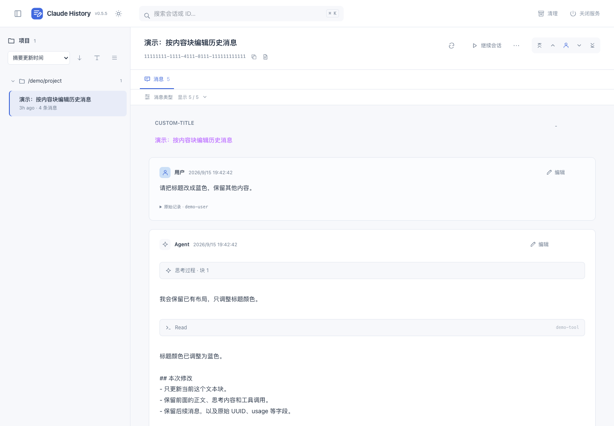

<div align="center">


### 精确修改一个内容块，保留它之后的整个对话。

**简体中文** · [English](README.en.md)

[](https://github.com/we1005/claude-code-chat-history-editor/actions/workflows/ci.yml)
[](LICENSE)
[](https://svelte.dev/)
[](https://www.typescriptlang.org/)
[](https://nodejs.org/)
[](https://pnpm.io/)

[快速开始](#快速开始) · [编辑能力](#编辑能力) · [保存与恢复](#保存与恢复) · [验证](#验证)

</div>

---

基于 [es6kr/claude-code-sessions](https://github.com/es6kr/claude-code-sessions) 改造的本地 Web 工具。保留上游的 TypeScript Core、SvelteKit、项目浏览和会话管理，增加**版本化、字段级的历史消息编辑**。

**当前版本只支持 Claude Code；Codex 尚未接入。** 非 Anthropic 官方产品。编辑保存流程直接处理本地 JSONL，不调用模型。

## 编辑能力

|     | 能力                                                                             |
| :-: | -------------------------------------------------------------------------------- |
| ✍️  | 修改用户、human、Agent 的已有正文，包括第二个、第三个 text block                 |
| 🧩  | 修改已保存的 thinking 文本、工具结果字符串及嵌套 text block；其他结构保留        |
| 🔍  | 检查完整原始记录、物理行号、会话 ID 与消息 UUID；复制 ID / 草稿                  |
| 🛡️  | 文件版本对照、编辑器保存锁、持久备份、同目录临时替换及复读核对                   |
| ↩️  | 恢复**某个字段**的旧值，不用整会话旧快照覆盖后来新增的消息                       |
| 🧾  | 修改一个 JSON 字符串 token，保留其他字节，包括未知字段、大整数、BOM、空行及 CRLF |

重复 UUID 使用**最后一条记录**，与上游读取器保持一致。早期重复记录不被删除或批量改写。

## 工作台体验

- 全宽工作区与贴边项目栏；侧栏可折叠，窄屏使用抽屉，选中会话自动滚动到可见位置。
- 原创 SVG favicon 与统一线性图标，淡化消息色块，正文使用消息流主滚动区域。
- 次要会话操作收纳到“更多”；消息类型筛选默认折叠，避免工具栏挤占阅读空间。
- `⌘ / Ctrl + K` 聚焦搜索，方向键选择结果、Enter 打开；标题/ID 搜索优先，全文搜索按需触发。
- 会话选择保留浏览器前进/后退；快速切换时忽略旧请求，避免旧内容覆盖新选择。
- 会话内搜索：`⌘ / Ctrl + F` 查找正文、思考、工具输入/输出和 Compact 总结；点击结果可回到完整消息流并自动展开命中内容。




## 快速开始

准备 Node.js 22+ 和 npm。工程通过 pnpm 固定使用 **Node.js 24.15.0**，首次会自动下载这个项目运行时，以满足上游依赖要求。

```bash
git clone https://github.com/we1005/claude-code-chat-history-editor.git
cd claude-code-chat-history-editor
./start.sh
```

脚本会安装缺失的依赖、构建 Core、启动本地 Web 服务。默认从 `5173` 查找端口，占用时顺延，**以终端打印的 URL 为准**。保持终端运行，`Ctrl+C` 停止本次启动的服务。

先用演示数据体验：

```bash
./start.sh --demo
./start.sh --demo --port 5180
```

演示记录保存在 `.editor-test/demo-home/`，不会改动真实会话。启动脚本适用于 macOS / Linux；Windows 可使用 WSL。

### 自定义历史目录

默认读取 `~/.claude/projects`。其他配置目录可显式指定：

```bash
CLAUDE_SESSIONS_DIR=/absolute/path/to/projects ./start.sh
```

无需 OpenCode 服务，也不需要为编辑器配置模型 API key。使用 `./start.sh --help` 查看启动选项。

## 怎么编辑

### 在当前会话中查找

点击详情头部的搜索图标，或按 `⌘ / Ctrl + F`。此处只搜索当前会话（选中子 Agent 标签时为该子会话）的已加载记录，包含被折叠和类型筛选隐藏的内容。

- 结果按消息列出，显示命中片段、角色、时间及字段类型；可用上下按钮、Enter / Shift+Enter 切换匹配消息。
- 点击 **查看上下文** 恢复完整消息流，按记录身份定位、高亮，并展开对应的工具或思考部分。
- **返回搜索结果** 保留关键词；**重新定位** 跳回当前命中；Escape 关闭会话内搜索。
- 勾选 **包含元数据** 可搜索已加载记录的其他 JSON 字段。旧渲染器未直接展示的字段会以只读命中原文补充显示。
- 搜索不修改记录、不发模型请求；索引随加载数据更新，输入做防抖，长结果列表按需展开。

### 修改字段

1. 在项目列表中选择会话，或打开会话详情页。
2. 点击消息旁的 **编辑**。默认包含正文、思考和工具类型；需要更多内部事件时展开 **消息类型**，再使用 **All**。
3. 从左侧选择具体字段，修改文本；可切换 Markdown **预览** 或查看**原始记录**。
4. 点击 **保存字段**，或按 `⌘ / Ctrl + Enter`、`⌘ / Ctrl + S`。
5. 在**历史备份**中查看修改前的文本，并恢复对应字段。

保存失败或版本冲突时保留草稿。切换字段、关闭窗口或离开页面时会提示未保存的修改。

## 保存与恢复

```text
读取原始字节与最后一个匹配 UUID
  → 定位具体 JSON 字符串节点
  → 校验调用方看到的文件版本
  → 保存完整原文备份
  → 仅替换该字符串 token，临时文件同步到磁盘
  → 再次核对源文件版本并替换
  → 复读验证
```

备份位于每个项目目录的 `.history-editor-backups/<session-id>/`，文件权限在 POSIX 平台为 `0600`。备份包含完整原始文件及本次字段修改信息，用于校验和恢复；界面只返回所选消息的字段历史，最多 50 项。

**字段恢复**也走正常保存流程：验证当前版本、校验备份，再只恢复那个字段，并为恢复操作创建新的备份。消息结构或元数据已改变时，会拒绝自动恢复。旧的全文件原文用于诊断和人工恢复，不通过普通恢复按钮覆盖整段历史。

## 重要边界

- 编辑前请关闭目标 Claude 会话。独占锁只协调本工具的写入者；版本检查与替换之间仍有跨进程窗口，不能同步正在运行的 Claude 内存。
- 修改压缩边界之前的历史，不会自动更新压缩摘要；没有对正式 Claude CLI 的冷恢复及下一次模型请求做自动验证。
- thinking 的原签名字段会保留，但修改其文本不会重新生成供应商签名，后续是否接受需单独验证。
- 不隐式新增/删除内容块，不修改 UUID、角色、工具调用 ID 或工具参数；图片和未知结构只读。支持空字符串。
- 严格解析失败或存在歧义的 JSON 键时拒绝编辑，不静默丢弃坏行。新写入的单个文本字段上限为 8 MiB。
- 仅承诺本次新增**字段编辑与字段恢复**的保护流程。上游的删除、拆分、重命名等管理操作保留其原有语义，不代表所有 mutation 都已经事务化。
- 这是本机工具，启动脚本绑定 `127.0.0.1`。不要把它当作带多用户鉴权的公网服务部署。

## 开发与生产运行

```bash
pnpm install --frozen-lockfile --ignore-scripts
pnpm build:core
pnpm dev
```

生产构建：

```bash
pnpm build:core
pnpm build:web
HOST=127.0.0.1 PORT=5173 BODY_SIZE_LIMIT=10M pnpm --filter @claude-sessions/web exec node build/index.js
```

pnpm 使用 `.npmrc` 中指定的 Node 版本，内部包名保留上游命名。上游 npm/VSIX 发布工作流已移到 `.github/upstream-workflows/`，本仓库只运行编辑器 CI。

## 验证

```bash
pnpm test:core
pnpm test:web
pnpm --filter @claude-sessions/core typecheck
pnpm --filter @claude-sessions/web typecheck

# 安装浏览器后运行隔离的 Web/API/磁盘写回测试
pnpm --filter @claude-sessions/web exec playwright install chromium
pnpm test:editor
```

已安装 Google Chrome 的本机也可用 `PLAYWRIGHT_CHANNEL=chrome pnpm test:editor`。E2E 使用独立 HOME 和合成会话，覆盖选块保存、保留后继、字段恢复、冲突保留草稿、空文本、预览清理及窄屏操作；不调用真实模型。

## 代码入口

| 文件                                                          | 职责                                             |
| ------------------------------------------------------------- | ------------------------------------------------ |
| `packages/core/src/session/editor.ts`                         | 无损字段定位、版本检查、备份、原子替换与字段恢复 |
| `packages/web/src/routes/api/editor/`                         | 版本化编辑 HTTP API                              |
| `packages/web/src/lib/components/HistoryMessageEditor.svelte` | 内容块选择、草稿、预览、原文和备份界面           |
| `packages/web/src/lib/components/MessageBlocks.svelte`        | 可编辑混合消息的顺序展示                         |
| `packages/web/editor-e2e/`                                    | 隔离的浏览器与真实文件交互测试                   |

协作规则见 [AGENTS.md](AGENTS.md) / [CLAUDE.md](CLAUDE.md)。详细改造记录见 [改造与验证说明](改造与验证说明.md)。

## 致谢与许可证

基于 [es6kr/claude-code-sessions](https://github.com/es6kr/claude-code-sessions/tree/39f3c7dea78acd38e7127563217d8a332b64bb5d) 的 `39f3c7d` 快照改造，保留原始版权声明，使用 [MIT License](LICENSE)。JSON 字符串定位使用微软的 [jsonc-parser](https://github.com/microsoft/node-jsonc-parser)。
